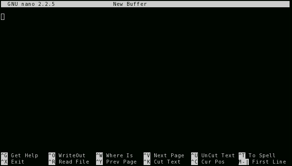
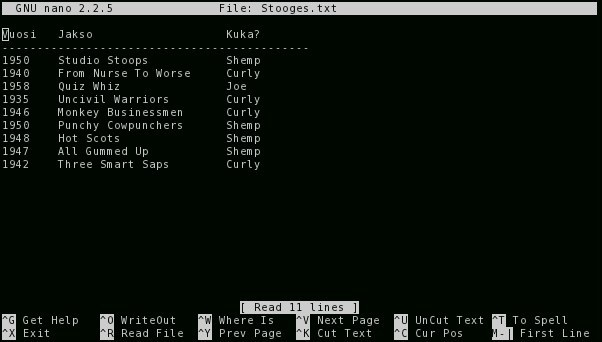

Nano
====

:Matias:        Olemme puhuneet paljon editoreista, mutta ette taida vielä
                osata ainuttakaan, joka toimii hyvin terminaalissa.
:Hemmo-Joachim: No `nano` on kyllä mulle tuttu. 
:Matias:        Ai on? Voit käydä sen. Minä ajattelin `vi`:llä aloitella,
                mutta ehkä on parempi ottaa helpommin.
:Ville:         Mutta miksi ei voida käyttää vaikka Katea? Olisi sentään
                jotain järkeä tuossa editoinnissa.
:Matias:        Katellako meinasit editoida ssh-yhteyden yli? Onnistuu se kai
                jotenkin, mutta on hyvä osata käsitellä tiedostoja ihan
                paikanpäältä.

                Hemmo voinee nyt ottaa ohjakset, kun en ole noita kahta
                käytellyt aikoihin. Liekö ikinä, kun tarkemmin miettii.
:Hemmo-Joachim: Mitä kahta?
:Matias:        `nano` pohjautuu vanhempaan `pico`-editoriin. Jos `nano` ei
                ole asennettuna, niin `pico`:n pitäisi ainakin olla.

                Ja kun nanoa osaa käyttää, niin picon alkeet ovat täsmälleen
                samat.
:Hemmo-Joachim: No ok. Nanon käyttäminen on helppoa kyllä. Jos sen käynnistää
                sellaisenaan, niin se tarjoaa tyhjää tiedostoa, johon voi
                kirjoitella. Kuin Muistio.

:Matias:        Onpas ruma.
:Ville:         No elä.
:Hemmo-Joachim: No, nyt se siinä kuitenkin sitten seisoo. Ja tosta alhaalta on
                helppo katsella ne tärkeimmät pikanäppäimet, ei ole tarvetta
                tehdä listausta. Noita sitten luetaan niin, että `^X`
                tarkoittaa `Ctrl-X`:ää. Ja `M-F` tarkoittaa `Alt-f`:ää.
:Ville:         Mistä se `M` siihen sitten tulee?
:Matias:        M niin kuin Meta. Metanäppäin oli vähän vaihtelevampi käsite
                vanhoissa tietokoneissa. Nykyisin se on toki lähes
                satavarmasti Alt. Jos huomaatte joskus, että `Alt-f` ei
                toimikaan (jotkut terminaaliklientit ja Windowsin SSH-ohjelmat
                voivat tehdä tätä) niin vaihtoehto on painaa ensin Esciä ja
                sitten loput näppäinyhdistelmästä.

                Nämä kaksi näppäilyä tuottavat siis saman `M-F` -yhdistelmän:

                - `ESC f`
                - `Alt-f`
:Hemmo-Joachim: No johan on. Joskus ei ole toiminut toi altti esimerkiksi
                irssissä niin en ole osannut vaihdella kanavia.
:Ville:         No sen mä tiesinkin, että irssissä voi käyttää molempia
                muotoja. En vaan arvannut, että se on yleinen toiminta.
:Matias:        Näin se on. Jatkammeko nanon parissa?
:Hemmo-Joachim: Joo tota. Tiedoston avaaminen nanoon on helpoin tehdä ton
                käynnistyksen yhteydessä::

                    nano [File]

                Ja se näyttää tältä:

:Hemmo-Joachim: Ja nyt siinä voi liikkua ja muokata kuin Muistiossakin.
                Hassusti pastetus on nimetty `UnCut` -- en tiedä, onko se
                sitten vain vanhempi termi sille.

                Mutta muuten. `^W` on näppärä tapa hakea hakusanalla -- ja
                kirjainkoolla ei ole merkitystä. Haun voi toistaa
                näppäinyhdistelmällä `M-W`. Eipä tossa ole muuta ihmeellistä.

                Niin, savetus onnistuu `^O`:lla. Se kysyy kyllä tiedostonimeä,
                mutta se vanha nimi on siinä oletuksena, joten voit painaa
                enteriä niin se tallentaa päälle.

                Ja pois pääsee `^X`:stä, kuten alapalkissa lukeekin.
:Matias:        Ja ehkä tärkein asia unohtui...
:Hemmo-Joachim: Mikä?
:Matias:        No olisiko ohje. Se näkyy olevan kuvien perusteella `^G`.
                Kannattaa aina kattella ensin ohjeista, jos ei tiedä, mitä on
                etsimässä. Tutkailin tuota ohjetta ja siinä on noi näppäimet
                ja toiminnot selkeästi esillä.
:Hemmo-Joachim: Niin on joo.
:Matias:        Ainut vain, että hakutoiminto ei näytä toimivan ohjeikkunassa.
                Aika kehnoa suunnittelua. 
:Ville:         Mutta hei -- avasin jonkun oman jutun, ja ne rivit menee
                näytön ulkopuolelle. Miten tässä voi panna rivityksen päälle?
:Matias:        Näyttäisi olevan ainakin optio `-$`, joka tekee sen. 
                Voit toki aktivoida sen vasta nanon sisällä, näppäinkomennolla
                `M-$`, joka on tietty vähän hankala euronäppiksille.
                
                Mutta nano rivittää rumalla tavalla. Se voi kuulostaa
                pöljältä, mutta useimmat Unix-ohjelmat pitävät kapeista
                tiedostoista.

Riittäisiköhän se nanosta (ja picosta)?
