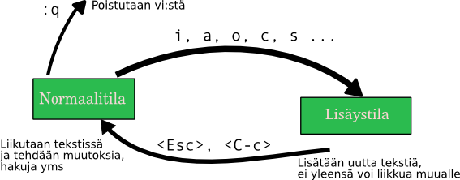

Vi
==

:Hemmo-Joachim: Hei Masa, miten tästä pääsee ulos?
:Matias:        Mitäs olit tekemässä?
:Hemmo-Joachim: No yhdessä ohjeessa puhuttiin tiedoston editoimisesta
                `vi`-ohjelmalla.
:Matias:        Ah, vanha tuttu `vi`. Voidaankin käydä sen alkeet läpi. Ja nyt
                puhun todella vain alkeista, sillä editoreja on muitakin. Vi
                on kuitenkin niin yleinen, että ainakin on hyvä opetella
                pärjäämään sen kanssa.

Vi on 70-luvun lopuilla rakennettu interaktiivinen kokoruudun editori. Sitä
ennen tehtävät tehtiin rutkasti hankalammin ns. rivieditorien voimin.
Ensimmäinen Unix kirjoitettiin rivieditorin voimin. Myös Vi on vanha ja kankea
tapa tehdä tekstin editoimista nykypäivänä, mutta auttaa tuntea sen perusteet.
Ja jos idea jostain syystä kuulostaakin hyvältä, Vi:n modernisointi Vim on
nykyaikainen ja monipuolinen editori kaikenlaisiin tekstitehtäviin.

`Vi` on `ed`:in ohella niitä klassikko-ohjelmia, jotka kaappaavat muuten hyvin
yleisen keskeytyskomennon `<C-c>` omiin tarkoituksiinsa, joten sitä painamalla
ei pääsekään ulos editorista. Senkin takia on nyt hyvä kertoa minimaalinen
katsaus tähän ohjelmaan.

Keskeiset komennot
------------------

:Matias:        Annahan kun minä listaan teille joitain peruskomentoja vi:stä.

+---------+------------------------+------+---------------------+
| `:q!`   | **Sulkee               | `:w` | Tallentaa tiedoston |
|         | tallentamatta**        |      |                     |
+---------+------------------------+------+---------------------+
| `:wq`   | Tallentaa ja sulkee    | `yy` | Kopioi rivi         |
+---------+------------------------+------+---------------------+
| `i`     | Hyppää insert-modeen   | `p`  | Liitä rivi alle     |
+---------+------------------------+------+---------------------+
| `<ESC>` | Poistu insert-modesta  | `P`  | Liitä rivi ylle     |
+---------+------------------------+------+---------------------+
| `k`     | Ylös                   | `dd` | Leikkaa rivi        |
+---------+------------------------+------+---------------------+
| `j`     | Alas                   |      |                     |
+---------+------------------------+------+---------------------+
| `h`     | Vasemmalle             | `l`  | Oikealle            |
+---------+------------------------+------+---------------------+

:Ville:         WTF?!
:Matias:        Tiedän, että se näyttää vähän pahalta.
:Hemmo-Joachim: Hyvä että panit tärkeimmän näkyville ensimmäisenä! Miten
                ketään voi käyttää tuommosta -- ja `jk` nuolinäppäimien
                sijasta.
:Matias:        Tämä editori saa voimansa siitä, että liikkumakomentoja on
                valtavasti erilaisia, ja kaikki helposti saatavilla
                näppituntumalla. Se on saavutettu tekemällä vi:stä modaalinen.

Modaalisuus tarkoittaa tässä tapauksessa sitä, että editorin eri tiloissa
(moodeissa) näppäinkomentojen merkitys vaihtelee. Vi:ssä on useita eri
moodeja, mutta kaksi tärkeintä riittää mainita oleellisuuden vuoksi:

normaalitila (normal mode)
    Tämä on tila, jossa liikutaan tiedostossa. Tästä tilasta pääsee ulos
    vi:stä, joka lienee tärkeintä tietää tässä vaiheessa.
lisäystila (insert mode)
    Tähän tullaan normaalitilasta komennolla `i`. Nyt aakkoset toimivat
    tavalliseen tekstinsyöttötapaan. Tästä tilasta pitää tulla erikseen ulos
    kaikkea liikkumista varten. Se tapahtuu yleensä Esciä painamalla, mutta
    ehkä helpompaa on käyttää `<C-c>`:tä (Ctrl-C)

Tilakaavion muodossa näin:

--------------  

:Hemmo-Joachim: Mä taidan jatkaa ton `nano`:n kanssa. Ja mikä ihmeen juttu toi
                `hjkl` on -- eikö vanhoissa koneissa ollut nuolinäppäimiä?
:Matias:        Kyllä niissä oli, mutta eräät terminaalit lähettivät niistä
                aakkoskoodeja, juuri nuo pahamaineiset näppäimet.

                Mutta toisaalta myöhemmin havaittiin, että `hjkl` toimii
                kivasti ihan yksinäänkin, vaikka näppäimistössä olisikin
                nuolta tarjolla.

                Teidän kannattaa vain toivoa, että niissä Unix-ympäristöissä,
                joissa liikutte, tulee nuolinäppäimet luetuksi oikein. Jos ei,
                niin on parempi alkaa totutella noihin `hjkl`:ään.
:Ville:         Taitaa toi aiemmin käsitelty `nano` olla ihan sopiva meikälle.

Vim
---

Vi oli aikoinaan suljettua koodia, ja sitä ei saatu niin monelle tietokoneelle
kuin olisi ollut kysyntää. Siitä tehtiinkin paljon klooneja, joista
yksi on nykypäivänäkin kovaa kamaa: 90-luvun alussa syntynyt **Vim**. Vim
perii kaiken, mitä alkuperäinen ja kankea `vi` on, ja lisää *sairaasti* lisää
toiminnallisuutta vanhan päälle.

Jos teidän käy tuuri, on systeemissä asennettu jo Vim tavallisen vi:n sijaan.
Voitte saada syntaksiväritystä ja todennäköisemmin toimivaa nuolinäppäintä.
Sekä sellaista herkkua kuten online-ohjeita (kokeile komentoa `:help`
normaalitilassa).

Jatkoa varten
-------------

Yksi opas on erityisen hyvää luettavaa, jos Vi:n käytön syvempi opettelu
kiinnostaa: `Learning the vi and Vim Editors`_ (Robbins, Hannah, Lamb). Hyvää
luettavaa, jos mielesi tekee hakkeriksi, vaikka olisitkin valinnut Emacs-tien.
Kirjassa käydään `ex`-rivieditorin perusteet sellaisenaan. Siitä on hyötyä
skriptauksessa.

.. _`Learning the vi and Vim Editors`: http://oreilly.com/catalog/9780596529833

